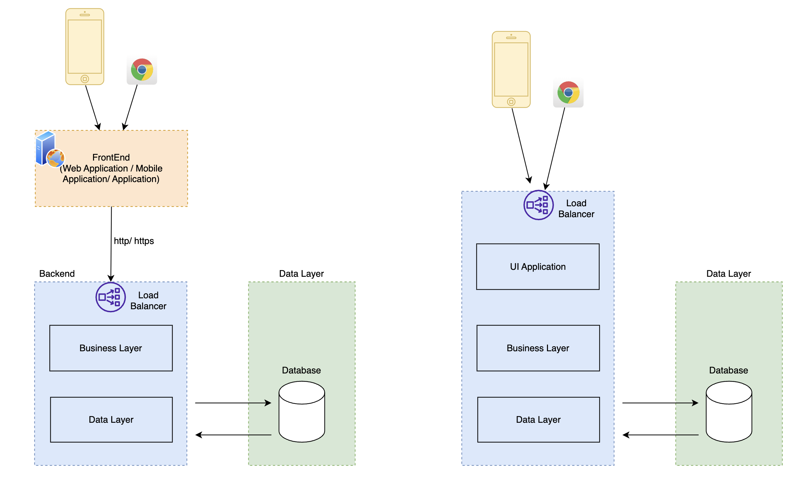
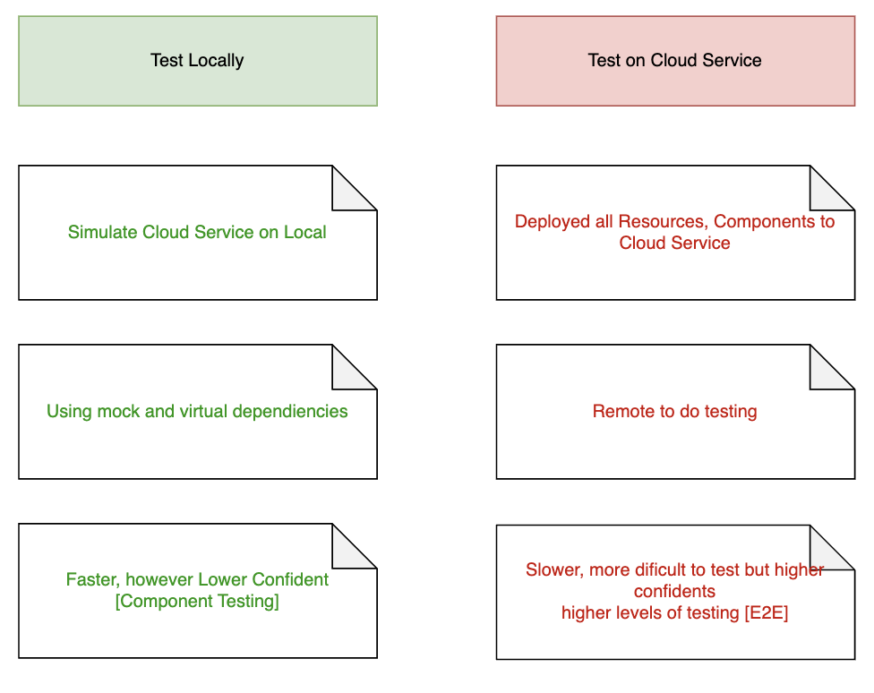
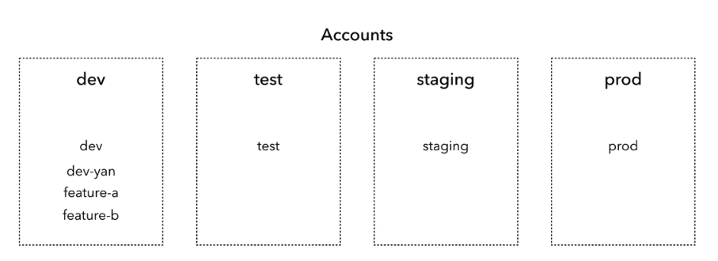

## Microservice Architecture
Microservices - or microservice architecture - is an architectural style to develop the application that structures an application as a collection of minimal componnent as services.
They are seperated by: 
+ Business purposes or capabilities.
+ Deploymenent independently.
+ Developed, Deployed, Managed by smaller team.

Then, each microservice will have these properties:
+ Independently deployable
+ Serveral integration partterns with other microservices (sync, asyns, ...)
+ Can be tested isolatedly and can be tested in integration level and integrated levels.
(When your application are designed and developed in microservices architecture, the demands of your software will be more and more complex)

## Monolith and Microservice Architecture
As below image, we have the simple web application that built in  Monolith Architecture:

Any changes on code base of software in Monolithic will impact to all software functions, we have to test all functions to make sure the quality => higher software testing efforts, especially in E2E Testing. Then, it's difficult for us to manage and monitor the quality.

Almost of Testing for Monolithic are focused on Unit testing and e2e testing only. 

The big problem in Monolith architecture is scaling the system in Monolith, when multi-team will work in the same code base.

The example microservice architecture system:

- Difference Monolith vs Microservice Architecture:

The principle to migrate a system from Monolith to microservice architecture:
refer to: https://microservices.io/post/refactoring/2020/07/28/six-principles-for-refactoring-to-microservices.html

## Communcation protocol in Microservice Architecture:
There are serveral communication protocols to build the system in microservices architecture. In each targets or specific scenarios, we will choose the proper communication types to transfer message or data between components.
We can classify to 2 main protocol types: Sync and Async.

Base on the communicaiton protocol among components and microservices, we will have 2 kinds of coupling to measure the dependency of each components in our microservices architectures.
- Tight coupling
- Loose coupling.

Read more [Here](./sync-and-async.md)

## Microservice Testing
In this session, we will collect all points in Testing to cover the quality of system in Microservice Architecture.
Reading more [here](./microservice-testing.md)

# Serverless Architecture
In order to build and deploy the software, we tend to use the serverless architecture, it meants that we don't need to manage the infrastructure. We will use the cloud infrastructure services to build and manage our application.

The development team can focus on the product design and application layers with scaable system designs instead of managing and operating the servers and keep the infrastructure availabilities.

- [AWS Services](https://aws.amazon.com/serverless/): AWS API Gateway, Lambda function, AWS ECS, AWS EKS, Step Function, S3, ..
- [Azure Services](https://azure.microsoft.com/en-us/solutions/serverless):
- [Google Cloud](https://cloud.google.com/): Azure Function, Kubernetes Service, Block Blob, ...

Image refered to: https://adex.ltd/microsoft-azure-vs-aws-vs-google-cloud/

## Everything about Serverless testing
Difficulties , Questions and challenges:
- Conplex application system.
- More testing layers and paradigm approaches.
- Isolated testing.
- Test locally ? Simulate AWS locally to do testing ? or Test full remotely on AWS service ? 
- How we run automated test with AWS Serverless Services ?

### AWS Direct Service Integration
- [AWS Steps Function](https://docs.aws.amazon.com/step-functions/latest/dg/welcome.html):
- [AWS AppSync](https://docs.aws.amazon.com/appsync/latest/devguide/what-is-appsync.html)
- [AWS API Gateway](https://aws.amazon.com/api-gateway/)

Example:
- Example 1: [AWS Direct Service Integration](./aws/test-apigateway-lambda-dynamodb/readme.md)

### AWS Event Driven Components:
- SNS
- Event-Brigde
- SQS
- Kinesis

## Serverless - AWS Service with isolated environmemt
We are working in mutitlple testing environment with different aws accounts. It helps us devide our testing to more test levels, easier to control the quality of products. We can consider the below model, all these environment are just standalone CloudFormation (AWS) stacks and can be easier to deployed, managed and removed (cleaned up the lower environment) if we needed.

## Temporary test environment with https://school.theburningmonk.com/: 
This ideas is manipulated as the testing demands: setup: run test: and teardown, to keep our testing rerunable and executable continuously.
In order to run e2e testing, we have to seed the testing data and make sure our testing environment be ready before we run the test.

## References:
- https://aws.amazon.com/lambda/serverless-architectures-learn-more
- https://www.infoq.com/news/2016/08/serverless-autodesk/

# References:
- Microservice IO: https://microservices.io/index.html
- From Monolith to Microservice:
https://microservices.io/patterns/Monolith.html
- https://learning.oreilly.com/library/view/microservices-patterns/9781617294549/
- https://medium.com/javanlabs/micro-services-versus-Monolith-architecture-what-are-they-e17ddc8d3910
- Communication: https://learn.microsoft.com/en-us/dotnet/architecture/microservices/architect-microservice-container-applications/communication-in-microservice-architecture
- Microservice with AWS: https://aws.amazon.com/blogs/architecture/architecting-a-highly-available-serverless-microservices-based-ecommerce-site/
- Monolithic and Microservices: https://aws.amazon.com/compare/the-difference-between-monolithic-and-microservices-architecture/
- Challenges in Microservice testing: https://www.browserstack.com/guide/end-to-end-testing-in-microservices