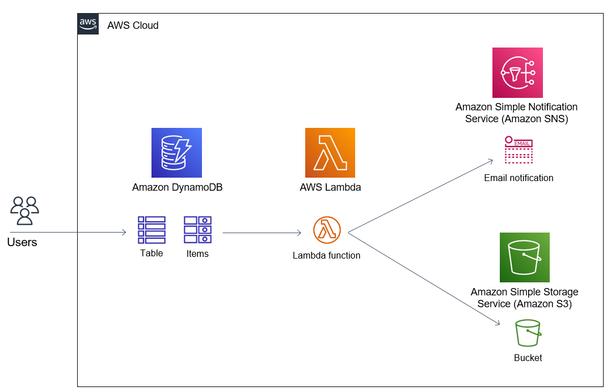

# Diagram


# Note
- Dynamodb with enabled DynamoDB Stream. `users_table`
- Capture item level changes on an Amazon DynamoDB table and process them using an AWS Lambda function via a trigger.
- Create a Lambda function - python 3.8 `stream-user`
- Enable trigger on Lambda from Stream Dynamodb and we will receive this error such as:

```
An error occurred when creating the trigger: Cannot access stream arn:aws:dynamodb:{region}:{account}:table/users_table/stream/yyy-mm-đThh:mm:ss.sss. Please ensure the role can perform the GetRecords, GetShardIterator, DescribeStream, and ListStreams Actions on your stream in IAM.
```
- We need to modify permission on IAM role, to be able to trigger Lambda from Dynamobd. By Creating inline policy for Dynamobd service these permissions: GetRecords, GetShardIterator, DescribeStream, and ListStreams actions among "Read" actions

- Create SNS notifications `users-change-sns` and creating a subscription with protocol `email` and endpoint `your email`
- Create S3 bucket: `users-bucket` with `ACLs enabled`

- Enable S3 on permission of lambda: Create an additional inline policy and allow creation of new files in our target Amazon S3 bucket as follows: Select S3 as service & Mark `PutObject` among Write actions.
- For the missing Amazon SNS permission, we require to provide `SNS:Publish` permission to our AWS Lambda execution role.

# Testing this Lab:
## E2E testing: 
We remote via AWS Console to access to Dynamodb to insert a new Index on `users_table`. In happy case, we expect that:
- Receive the message on Mailbox that we activated in subscription steps.
- Check S3 bucket, new Items in S3 bucket `users-bucket`
## Integration testing:

# References:
- SQS: https://docs.aws.amazon.com/AWSSimpleQueueService/latest/SQSDeveloperGuide/welcome.html
- AWS Lambda: https://docs.aws.amazon.com/lambda/latest/dg/welcome.html
- 
- https://www.kodyaz.com/aws/dynamodb-streams-send-sns-notification-from-aws-lambda-function-using-python.aspx