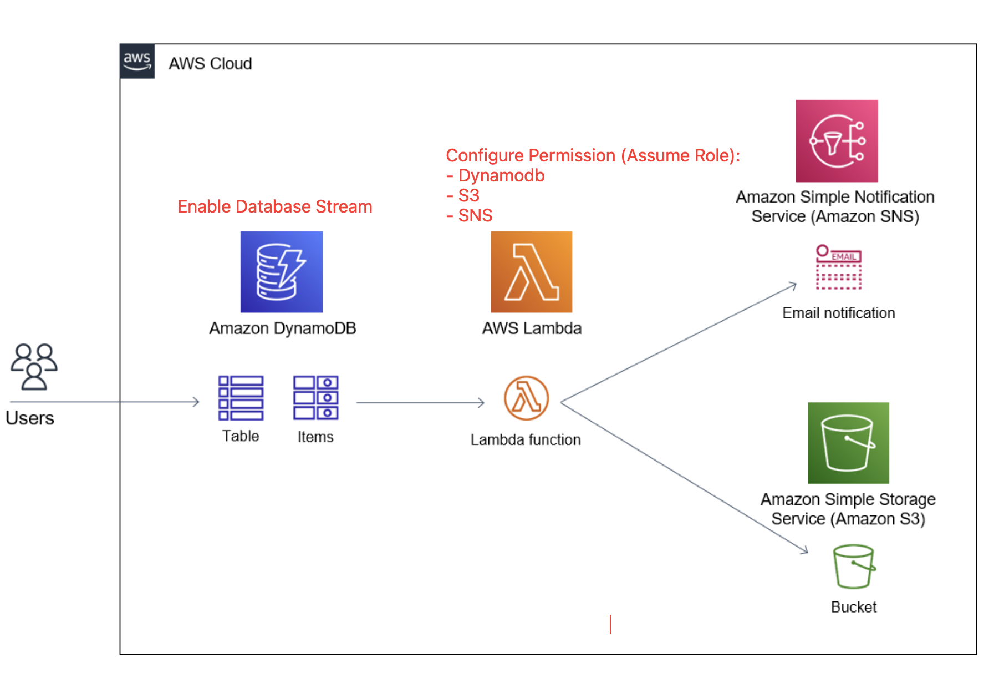

- Dynamodb with enabled DynamoDB Stream. `users_table`
- Capture item level changes on an Amazon DynamoDB table and process them using an AWS Lambda function via a trigger.
- Create a Lambda function - python 3.8 `stream-user`
- Enable trigger on Lambda from Stream Dynamodb and we will receive this error such as:

```
An error occurred when creating the trigger: Cannot access stream arn:aws:dynamodb:{region}:{account}:table/users_table/stream/yyy-mm-đThh:mm:ss.sss. Please ensure the role can perform the GetRecords, GetShardIterator, DescribeStream, and ListStreams Actions on your stream in IAM.
```
- We need to modify permission on IAM role, to be able to trigger Lambda from Dynamobd. By Creating inline policy for Dynamobd service these permissions: GetRecords, GetShardIterator, DescribeStream, and ListStreams actions among "Read" actions

- Create SNS notifications `users-change-sns` and creating a subscription with protocol `email` and endpoint `your email`
- Create S3 bucket: `users-bucket`