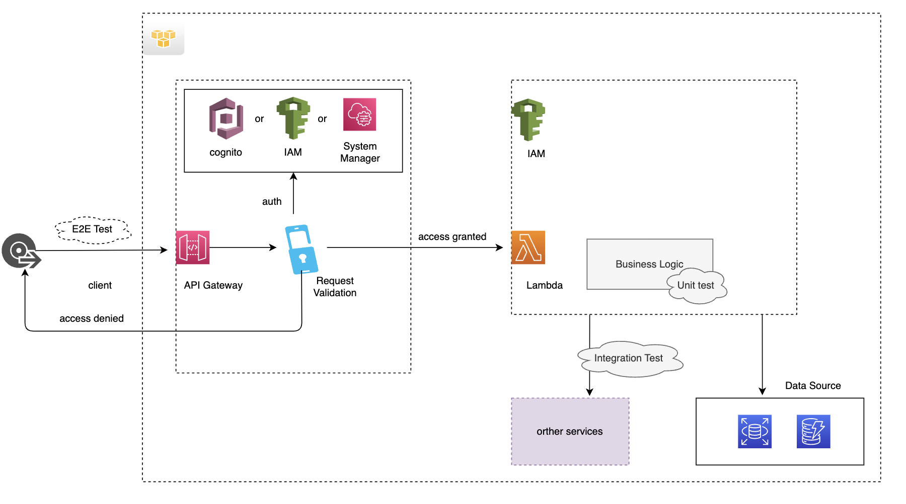

# API Gateway 

## Serverless Services in this projects
- AWS Gateway: https://aws.amazon.com/api-gateway/
- Dynamodb: https://aws.amazon.com/dynamodb/
- Lambda function: https://aws.amazon.com/lambda/

### Comparison between API Gateway REST APIs and HTTP API:
https://docs.aws.amazon.com/apigateway/latest/developerguide/http-api-vs-rest.html

## API Gateway APIs testing strategy:
We target to make sure our API will work properly after integrated with API Gateway APIs.
Example patterns:

## References:
- https://www.youtube.com/watch?v=_PAA3FmguyI