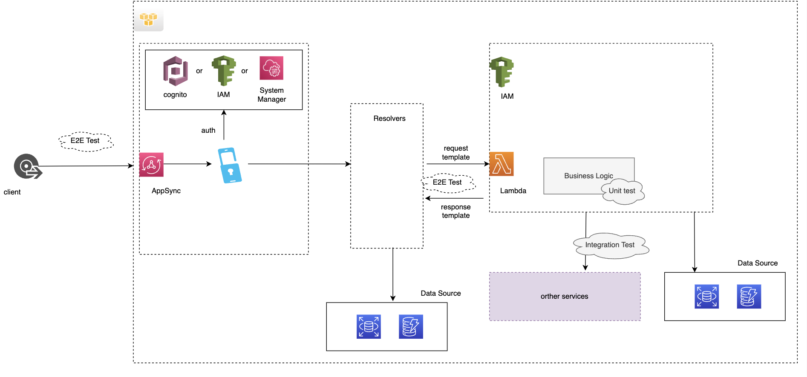

# AppSync and GraphQL 
- Appsync: https://aws.amazon.com/appsync/
- About GraphQL: https://graphql.org

Example:
- https://aws.amazon.com/blogs/mobile/aws-appsync-offline-reference-architecture/

## Basic terms in AppSync: 
- Resover Appsync [VTL]: https://docs.aws.amazon.com/appsync/latest/devguide/tutorials.html
- Resover Appsync [JavaScript]: https://docs.aws.amazon.com/appsync/latest/devguide/tutorials-js.html

# Testing AppSync and GraphQL

# References:
- https://aws.amazon.com/blogs/mobile/aws-appsync-offline-reference-architecture/