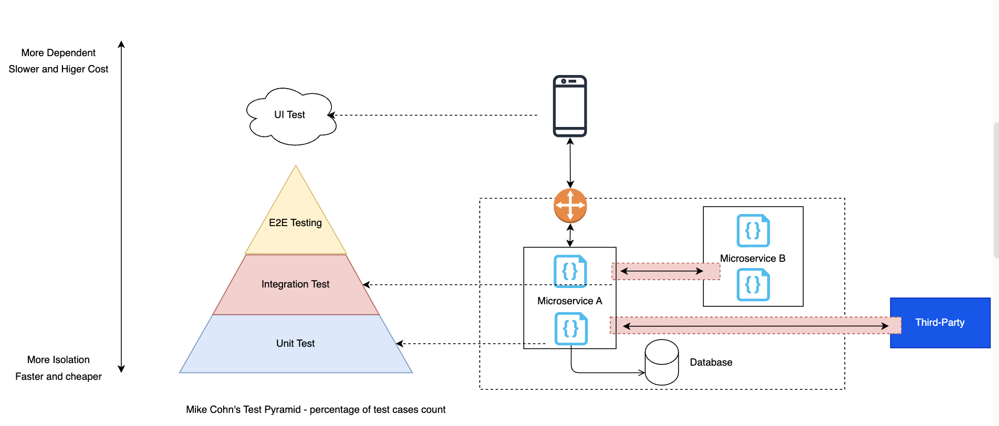

# All essential points about Microservice testing:
There are many benefits when our system is based on and built up in microservice architecture:
- Testing for each microservices.
- Deployment isolated
- Scale and maintainace each components / microservices

# The challenges of Testing in Microservice:
Microservice archtecture is more complex due to more components in a system, then it requires more testing for each layers or or each components.

Microservice requires QA and Development team change the mindset and testing strategy from Tranditional Strategy to Modern Testing Strategy.

## Tranditional QA Testing Approach:
- QA will perform testing and coordinated End-to-End testinng as Quality Gate before releasing the new version or deploying to production.

- In some cases, Testing activities will only start when the build is ready on testing environment. QA don't consider too much low layers and testing levels of applications.

- All Testing Activities depends on System Deployment status if System is working on Monolithic. It's too hard to perform testing earlier.

## The Advantages of Microservice about Testing, and the challenges for end-to-end testing:
### The Advantages of Microservice Architecture:
+ Microservices enables us to do isolated testing for each testing components.
+ Then we can cover lower levels of testing.
+ Therefore, we can do testing ealier and detect the issues sonner.
### Besides that, Microservice also brings more challanges into End-to-End testing:
(Refer to chaper 1, 1.2 in Testing Mountain Bank)
+ Microservice allows us multi-team works in multi-components and microservices, however we need to asssure the entire application will work correctly by our end-to-end testing. After all components and microservices integrated together in testing environment.
+ Therefore, the efforts of end-to-end testing will become higher at higher levels of testing, like end-to-end testing. It looks like the highway with multiple lances for cars, however we are limited at the end phase to be bootleneck and release congestion.

*Suggestions*: We decouple releases, so we can deploy the isolated service independiently, and then Independent Testing for each components will be covered easiler and be monitored easier. The drawback of this way is that requiring the systemm architecture should be designed to support isolated deployed and be testable as well. 

- The bigest challenges: *Our testing will be depent on many dependiencies, especially if our system works with our third-party side.*
What we depends on third-party dependiencies:
+ Deployment status: You wont' be able to do End-to-End testing once our partners/third-party sides are ready.
+ Integration status: The testing environment from the third-party be ready and available.
+ Data testing: In some actual scenario about business rules, we have to cover testing scenarios, we need to have the proper testing data, and they are controlled by our third-party. When we do end-to-end testing, we wil have supports from third-party to have proper testing data in correct expected scenarios in business rules.

- The cost of test environments is not Cheap, then The testing environments are shared amoung developmen-team.

# Testing Strategy for Microservice Testing:
After understanding of the difficulties and challenges about testing. We need to classify our testing in microservices into some testing levels as below:

+ Unit test
+ Integration Test
+ Component Téting
+ End to End Test
+ UI testing

Test Pyramid: https://martinfowler.com/articles/practical-test-pyramid.html

Testing Google at Scale: https://abseil.io/resources/swe-book/html/ch11.html

Based on TDD (Test-Driven Development), we should do testing more ranges and levels: It can include: test classes, methods in isolated views of each microservices and components, and the component view if our microservices works with other components or microservices (we can consider them as dependencies).

## Component Testing for each microservice
After understanding of the difficulties and challenges to do E2E testing, we tend to focus on performing the testing with lower layers, especially Component Testing.
In below image, we visualize the example of component view of serveral microservices with 2 famous communications types: Asnc and Sync.

In order to perform Component Testing for each Microservice as System-Under-Test, we apply Mocking library to replace the our micoservice's dependiencies. We can completely control our testing-data with mocking library (Virtual Supports), instead of depending on our third-party service.

*Component Testing Steps:*

+ List out the dependiencies of our System-Under-Test.
+ Provise and arrange the virtual components or mocking components to replace our dependiencies.
+ We can perform the testing actions to our System-Under-Test and get the returns from our system.
+ We can assert and verify the results from our System-Under-Test.
+ [Optional] We can implement test script to clean up data on our System-Under-Test and mocking components to make sure our testing execuable again.

Note: The above approach won't work to execute manual testing and parallel execution. We tend to run this way in isolated testing purpose.

However, with supports from virtual components, we can control:
+ Testing Data on virutal / mocking component instead of depending on third-party.
+ Easy to clean-up to make testing flexible and execuable again.
Example: Using a persistent data store [Refer to Chapter 1 - Mountain Bank testing - Book]

Example: Using Record - Playback with mocking service to record testing from real dependiencies

# Write tests. Not too many. Mostly integration. "Kent C. Dodds"
Refer to: https://kentcdodds.com/blog/write-tests
We tend to write test and focus more on Integration test to detect and prevent issues soon.
It can be the main factors to build up the test strategy with Honycob testing from Pyramid testing.

# Contract testing in Microservice testing
Contract Test: is a software testing methodology that tests the interactions between different microservices or software components based on the contracts between them. In contract testing, each service or component is given a contract, which defines how to work with the service and which responses to accept. 

Tools:
- Pact.io
- Spring Cloud Contract
- Karate DSL

## Consumer-Driven Contract Testing in Microsoft: 
https://microsoft.github.io/code-with-engineering-playbook/automated-testing/cdc-testing/

# Mocks and why we should use Mock ?
- Note: Mock is different to Stuffs.
https://martinfowler.com/articles/mocksArentStubs.html
- In Microservices, probably each microservice has many dependencies (dependency injection). We will take advantaged of many open-source library to create the faking dependiencies earlier and doing testing activities earlier.

Mocks:
- enable to test business logic isolation and without deployment
- doesn't cover integrated points

# Mocking tools and artifacts:
- Wiremock: https://wiremock.org/ 
- Mockoon: https://mockoon.com/
- Mockito and Java stack: https://site.mockito.org/
- Easy mock and Java stack: https://easymock.org/

# AWS Stack, Simulator with local service, not mock
- Simulate the real AWS Services.
- NOT: Feature lags / missing (There aren't full-services simulators)
- NOT: Doesn't simulate IAM
- NOT:False nagatives (Simulate problems)
- NOT: Brigttle (hard to fix)

# Now not Test Pyramid, now we are in HoneyComb Microservice testing strategy
We are going ton increase more tests in ealier levels with component and integration testing, we will have the approaches as HoneyComb, it replaces Pyramids. when we reduce Unit test and consider more integration and component testing.

References: https://engineering.atspotify.com/2018/01/testing-of-microservices/

# References:
- Martinfowler Microservice Testing: https://martinfowler.com/articles/microservice-testing
- PactIo: https://pact.io/
- Mountain Bank Testing: http://www.mbtest.org/
- Source code - Mountain Bank: https://github.com/bbyars/mountebank-in-action