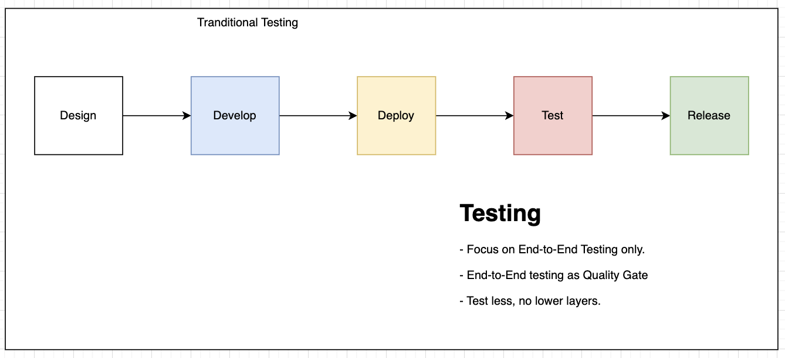

# All essential points about Microservice testing:
There are many benefits when our system is based on and built up in microservice architecture:
- Testing for each microservices.
- Deployment isolated
- Scale and maintainace each components / microservices

# The challenges of Testing in Microservice:
Microservice archtecture is more complex due to more components in a system, then it requires more testing for each layers or or each components.

Microservice requires QA and Development team change the mindset and testing strategy from Tranditional Strategy to Modern Testing Strategy.

## Tranditional QA Testing Approach:
- QA will perform testing and coordinated End-to-End testinng as Quality Gate before releasing the new version or deploying to production.

- In some cases, Testing activities will only start when the build is ready on testing environment. QA don't consider too much low layers and testing levels of applications.

- All Testing Activities depends on System Deployment status if System is working on Monolithic. It's too hard to perform testing earlier.

## The Advantages of Microservice about Testing, and the challenges for end-to-end testing:
### The Advantages of Microservice Architecture:
+ Microservices enables us to do isolated testing for each testing components.
+ Then we can cover lower levels of testing.
+ Therefore, we can do testing ealier and detect the issues sonner.
### Besides that, Microservice also brings more challanges into End-to-End testing:
(Refer to chaper 1, 1.2 in Testing Mountain Bank)
+ Microservice allows us multi-team works in multi-components and microservices, however we need to asssure the entire application will work correctly by our end-to-end testing. After all components and microservices integrated together in testing environment.
+ Therefore, the efforts of end-to-end testing will become higher at higher levels of testing, like end-to-end testing. It looks like the highway with multiple lances for cars, however we are limited at the end phase to be bootleneck and release congestion.

*Suggestions*: We decouple releases, so we can deploy the isolated service independiently, and then Independent Testing for each components will be covered easiler and be monitored easier. The drawback of this way is that requiring the systemm architecture should be designed to support isolated deployed and be testable as well. 

# Testing Strategy for Microservice Testing:

Based on TDD (Test-Driven Development), we should do testing more ranges and levels: It can include: test classes, methods in isolated views of each microservices and components, and the component view if our microservices works with other components or microservices (we can consider them as dependencies).

# Contract testing in Microservice testing
Tools:
- Pact.io
- 

# Mocks and why we should use Mock ?
- Note: Mock is different to Stuffs.
https://martinfowler.com/articles/mocksArentStubs.html
- In Microservices, probably each microservice has many dependencies (dependency injection). We will take advantaged of many open-source library to create the faking dependiencies earlier and doing testing activities earlier.

# Mocking tools and artifacts:
- Wiremock: https://wiremock.org/ 
- Mockoon: https://mockoon.com/
- Mockito and Java stack: https://site.mockito.org/
- Easy mock and Java stack: https://easymock.org/

# References:
- Martinfowler Microservice Testing: https://martinfowler.com/articles/microservice-testing
- PactIo: https://pact.io/
- Mountain Bank Testing: http://www.mbtest.org/
- Source code - Mountain Bank: https://github.com/bbyars/mountebank-in-action