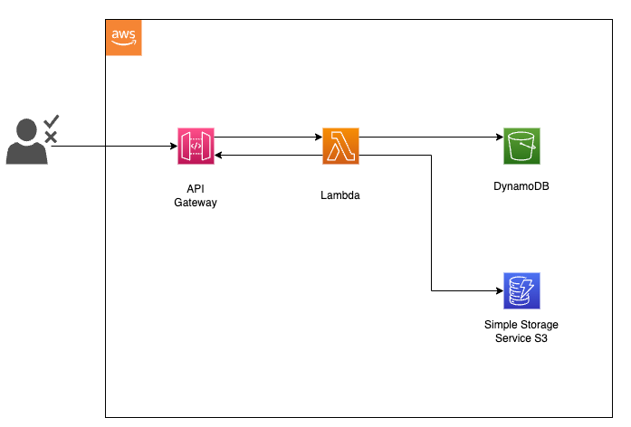

# Serverless ?
- AWS Serverless: https://aws.amazon.com/serverless/
- Azure Microsoft Serverless: https://azure.microsoft.com/en-us/solutions/serverless

# Testing challenges for Serverless Architecture:
We can do testing types:
- Unit test
- Integration test
- Component test
- E2E Test

## E2E testing
As End-User, tester will do:

### Manage resources, service in testing:  
Make sure all components (Including external service ready)
- We need to deploy (remote to deploy or using Pipeline to deploy), control the resource, how make them be ready before starting test, Run and Debug in Remote action
- Depend on the external services (Controlled by Third-party). Consider to test the logic when the service works with other services or external service.

### Testing the architecture of service works together as Distributed Architecture

In testing, we should have the view of Distributed services architecture. 
The couple of components / services of serverless works together.

# Tools for Serverless Testing:
- Integration Test with Moto: https://github.com/getmoto/moto
- AWS SAM: https://aws.amazon.com/serverless/sam/

# Testing AWS Lambda locally:

https://github.com/aws-samples/serverless-test-samples/tree/main/python-test-samples
## Example Unit test
Refer to: https://aws.amazon.com/blogs/devops/unit-testing-aws-lambda-with-python-and-mock-aws-services/
Example with API Gateway, Lambda, S3 and Dynamodb: 

### Functionality of each service:
1. API Gateway: provides an endpoint to request the generation of a document for a given customer.  A document type and customer identifier are provided in this API call.
2. Lambda: The endpoint invokes an AWS Lambda function that generates a document using the customer identifier and the document type provided.
3. Dynamodb: An Amazon DynamoDB table stores the contents of the documents and the users name, which are retrieved by the Lambda function.
4. S3: The resulting text document is stored to Amazon S3.

## Example Integration test

## Example E2E test

# Testing Asynchronous Architectures:
We can refer to here: https://github.com/aws-samples/serverless-test-samples/blob/main/python-test-samples/README-ASYNC.md#create-test-harnesses

## Testing Pyramid and Testing Honey Comb:
- https://dev.to/prozz/serverless-testing-pyramid-21f7
- [Honey Comb Serverless](https://www.infoq.com/presentations/honeycomb-serverless/?itm_campaign=rightbar_v2&itm_source=infoq&itm_medium=presentations_link&itm_content=link_text)

# References:
- Testing AWS Serverless Application: https://aws.amazon.com/blogs/compute/getting-started-with-testing-serverless-applications/
- Serverless Test and Debug: https://docs.aws.amazon.com/serverless-application-model/latest/developerguide/serverless-test-and-debug.html
- https://aws.amazon.com/blogs/compute/getting-started-with-testing-serverless-applications/
- AWS SAM: https://aws.amazon.com/serverless/sam/
- AWS SAM Github: https://github.com/josdoaitran/microservices-everything/tree/main/aws/aws-sam
- Integration Test with Moto: https://github.com/getmoto/moto
- Serverless-test-samples: https://github.com/aws-samples/serverless-test-samples
- Slide: Solving-Testing-Challenges-For-Serverless-On-AWS:https://pages.awscloud.com/rs/112-TZM-766/images/APMWQ3D4S4%20Solving%20testing%20challenges%20for%20serverless%20on%20AWS.pdf
- [Solving-Testing-Challenges-For-Serverless-On-AWS](https://lifesciences-resources.awscloud.com/vidyard-all-players/apmwq3d4s4-solving-testing-challenges-for-serverless-on-aws-2)
- Serverless Test in Principle:https://github.com/aws-samples/serverless-test-samples/blob/main/Serverless-Testing-Principles.md